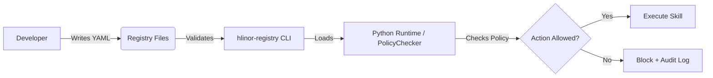

# Hlinor Agent Registry

Open-source registry layer for auditable AI agent systems.

Hlinor Agent Registry provides a structured way to define agents, departments,
skills, validators, policies, and execution boundaries. Unlike execution
frameworks, it focuses on declaratively defining what agents are **allowed**
and **blocked** from doing.

## 🚀 Quickstart (5 minutes)

### 1. Installation

```bash
pip install hlinor-registry
# or clone the repository:
git clone https://github.com/HlinorAI/hlinor-agent-registry.git
```

### 2. Define an agent configuration

Create `agent.yaml`:

```yaml
id: my-search-agent
name: My Search Agent
department: research
description: Searches and summarizes public information.
skills: [web-search, data-extraction]
validators: [freshness-validator]
allowed_actions: [search, read, summarize]
blocked_actions: [delete, send_email, modify_external_records]
policies: [no-stale-data, no-pii-leak]
```

### 3. Validate via CLI

```bash
hlinor-registry validate-agent agent.yaml
```

### 4. Enforce policies at runtime

```python
from hlinor_registry import PolicyChecker

checker = PolicyChecker(registry_dir="./")
is_allowed, reason = checker.check_action("my-search-agent", "send_email")

if not is_allowed:
    print(f"⛔ Action blocked: {reason}")
else:
    print("✅ Action allowed, executing...")
```

`PolicyChecker` evaluates an explicit blocklist first, then an allowlist. An
agent with no explicit action lists remains permissive for compatibility with
the registry model.

## 🏗 Architecture



## ⚖️ Why Hlinor Registry?

| Feature | Execution frameworks | **Hlinor Registry** |
| :--- | :--- | :--- |
| Primary goal | Task orchestration and execution | **Governance, security, and auditability** |
| Action control | Usually embedded in application logic | **Declarative YAML policy** |
| Auditability | Requires custom implementation | Designed for auditable decisions |
| Rule updates | Often require code deployment | Update YAML independently of agent code |

## Features

- Registry schemas for agents, departments, skills, validators, and policies
- Runtime binding, pre-dispatch authorization check, and execution receipt schemas
- Production action boundary and control loop schemas
- Agent lifecycle operating modes with transition gates and receipt schemas
- `hlinor-registry` CLI for validating and inspecting registry YAML files
- `PolicyChecker` for runtime allow/block decisions
- Synthetic YAML examples validated by the test suite

## Documentation

- [Execution model](docs/execution-model.md)
- [Approval model](docs/approval-model.md)
- [Runtime bindings and execution receipts](docs/runtime-receipts.md)
- [Audit trail](docs/audit-trail.md)
- [Control Layer architecture overview](docs/architecture/control-layer-overview.md)
- [Project isolation architecture](docs/architecture/project-isolation.md)
- [Task workspace architecture](docs/architecture/task-workspace.md)
- [Department handoff architecture](docs/architecture/department-handoff.md)

## Patterns

- [Agent lifecycle operating modes](docs/patterns/agent-lifecycle-operating-modes.md)
- [Lifecycle mode transition gates](docs/patterns/lifecycle-mode-transition-gates.md)
- [Production action boundary](docs/patterns/production-action-boundary.md)
- [Autonomous production control loop](docs/patterns/autonomous-production-control-loop.md)
- [Prerequisite acceptance gate](docs/patterns/prerequisite-acceptance-gate.md)

## CLI Usage

```bash
hlinor-registry validate <path>
hlinor-registry validate-agent <path>
hlinor-registry validate-department <path>
hlinor-registry validate-policy <path>
hlinor-registry validate-skill <path>
hlinor-registry validate-validator <path>
hlinor-registry validate-runtime-example <path>
hlinor-registry validate-production-action-boundary-example <path>
hlinor-registry validate-lifecycle-map <path>
hlinor-registry validate-lifecycle-receipt <path>
hlinor-registry validate-lifecycle-schema <path>
hlinor-registry validate-execution-context <path>
hlinor-registry validate-action-preflight <path>
hlinor-registry validate-capability <path>
hlinor-registry validate-protected-resource-boundary <path>
hlinor-registry validate-evidence-claim <path>
hlinor-registry validate-circuit-breaker <path>
hlinor-registry inspect <path>
```

The repository also includes validators for departments, policies, skills,
runtime examples, lifecycle contracts, capabilities, protected resources,
evidence claims, and circuit breakers.

### Execution context validation

```bash
hlinor-registry validate-execution-context \
  examples/execution-context/verified-host-native-execution-context.yaml
```

The execution-context contract distinguishes declared runtime markers from
verified capabilities and blocks live or production-sensitive operations when
the current environment is unverified or restricted.

### Runtime governance validation

```bash
hlinor-registry validate-action-preflight \
  examples/runtime-governance/cost-bounded-action-preflight.yaml

hlinor-registry validate-capability \
  examples/runtime-governance/verified-capability.yaml

hlinor-registry validate-protected-resource-boundary \
  examples/runtime-governance/protected-resource-boundary.yaml

hlinor-registry validate-evidence-claim \
  examples/evidence/evidence-claim-check.yaml

hlinor-registry validate-circuit-breaker \
  examples/control-loops/repeated-failure-stop.yaml
```

## Development

```bash
python -m pip install -e .
python -m pip install pytest
pytest
```

## Status

Early public release.

## License

Apache License 2.0
