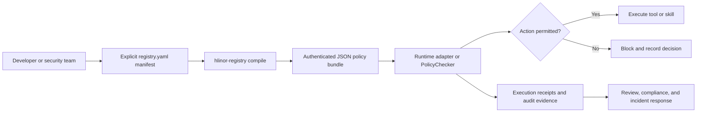

# Hlinor Agent Registry
>  **Latest:** [The OpenAI/Hugging Face Sandbox Escape: Why Declarative AI Governance is No Longer Optional](https://dev.to/ishvan/the-openaihugging-face-sandbox-escape-why-declarative-ai-governance-is-no-longer-optional-4onh) - Dev.to article

Open-source registry layer for auditable AI agent systems. Define what your AI agents may do, validate it before execution, and keep the decision auditable.
[](https://github.com/HlinorAI/hlinor-agent-registry/actions/workflows/test.yml)
[](https://github.com/HlinorAI/hlinor-agent-registry)
[](LICENSE)
[](https://pypi.org/project/hlinor-registry/)
[](https://github.com/HlinorAI/hlinor-agent-registry)

Define what your AI agents may do, validate it before execution, and keep the
decision auditable — without replacing the framework that runs your agents.

Hlinor Agent Registry is a declarative governance layer for agent systems. It
turns action boundaries, policies, approvals, and runtime evidence into
reviewable YAML contracts that developers and security teams can understand.

## Quickstart

### 1. Install from source

```bash
git clone https://github.com/HlinorAI/hlinor-agent-registry.git
cd hlinor-agent-registry
python -m pip install -e .
```

Once the package is published, the installation can be shortened to:

```bash
python -m pip install hlinor-registry
```

### 2. Declare the source files

Create a `registry.yaml` manifest. Only the files listed here can enter the
runtime bundle:

```yaml
version: "1.0"
policies:
  - path: "examples/secure_financial_agent.yaml"
  - path: "examples/budget_limited_research_agent.yaml"
metadata:
  environment: "production"
  compiled_by: "hlinor-registry-cli"
```

### 3. Compile and enforce

```bash
hlinor-registry compile \
  --manifest registry.yaml \
  --output dist/policy-bundle.json
```

```python
from hlinor_registry import PolicyChecker

checker = PolicyChecker("dist/policy-bundle.json")
decision = checker.check_action("financial-audit-agent", "initiate_transfer")

print(decision.result, decision.reason_code)
# denied ACTION_BLOCKLISTED_VIOLATED_POLICY_REQUIRE_HUMAN_APPROVAL_FOR_HIGH_VALUE
```

Compilation validates every listed file, rejects duplicate IDs and path
traversal, records per-file SHA-256 digests, and writes one authenticated JSON
bundle. Runtime enforcement reads that bundle only; it never scans a folder.

## Use cases

### Prevent PII leaks

Keep agents that process sensitive data away from external communication and
make the restriction explicit in a reviewed registry file:

```yaml
id: financial-audit-agent
name: Financial Audit Agent
department: finance
description: Audits internal financial reports.
skills: [read_database, anomaly_detection, generate_report]
validators: [financial-data-validator]
policies: [no-pii-in-logs, read-only-database-access]
allowed_actions: [read, analyze, summarize, generate_pdf_report]
blocked_actions: [send_external_email, delete_records]
```

The blocklist takes priority over the allowlist:

```python
decision = checker.check_action(
    "financial-audit-agent",
    "send_external_email",
)
assert decision.denied
```

### Block unauthorized actions

Use a strict allowlist for agents that should only perform a narrow set of
operations. Everything outside the list is denied by `PolicyChecker`:

```python
decision = checker.check_action("research-agent", "delete_records")

if decision.denied:
    print(f"Blocked before execution: {decision.reason_code}")
```

This gives security reviews a concrete answer to the question: “What can this
agent do?”

### Enforce API budgets and rate limits

Declare budget and rate-limit policies next to the agent's permitted actions.
Adapters or preflight checks can evaluate these policies before a costly call:

```yaml
id: web-research-agent
name: Web Research Agent
department: marketing
description: Collects competitor information from public sources.
skills: [web_search, scrape_public_website, summarize_text]
validators: [public-source-validator]
policies:
  - max_10_searches_per_hour
  - require_budget_check
  - block_known_malicious_domains
allowed_actions: [search, read_public_url, extract_keywords]
blocked_actions: [login_to_website, submit_forms, call_premium_paid_api]
metadata:
  api_budget_limit_usd: 5.00
```

The registry makes the constraint visible, versionable, and reviewable instead
of burying it inside one agent implementation.

## Architecture



Hlinor sits beside your execution framework. Your agents can continue to run
in LangChain, CrewAI, or a custom stack while their action boundaries are
compiled from an explicit, inspectable manifest.

## Hlinor vs. alternatives

| Capability | LangChain | CrewAI | Build it yourself | **Hlinor Registry** |
| :--- | :--- | :--- | :--- | :--- |
| Primary role | Agent and tool orchestration | Multi-agent orchestration | Whatever you implement | **Governance and policy layer** |
| Policy source | Application and tool code | Agent/task configuration | Custom conventions | **Declarative YAML contracts** |
| Action decisions | Add your own guardrails | Add your own guardrails | Fully custom | **Reusable PolicyChecker and validators** |
| Runtime boundaries | Framework-dependent | Framework-dependent | Custom | **Allowlist/blocklist patterns and schemas** |
| Audit model | Build around your stack | Build around your stack | Fully custom | **Audit-ready receipts and evidence schemas** |
| Works with other frameworks | Not the goal | Not the goal | Depends on design | **Designed to sit beside them** |

Hlinor is not an execution framework. Use it when governance must be explicit,
reviewable, and portable across the systems that execute your agents.

## Who is this for?

- Platform teams building internal agent infrastructure.
- Security and compliance teams reviewing agent capabilities.
- Developers who need a policy boundary before tools cause side effects.
- Teams operating multiple agents across departments or projects.
- Open-source maintainers who want YAML examples and automated validation in CI.

## Installation

### From PyPI

The PyPI package will be installable after the first package release:

```bash
python -m pip install hlinor-registry
```

The core package requires Python 3.10 or newer and PyYAML. It does not install
LangChain or another agent framework.

### Optional integrations

```bash
python -m pip install "hlinor-registry[langchain]"
```

Then wrap a compatible tool or executor:

```python
from hlinor_registry.integrations.langchain import GovernedAgent, GovernedTool

safe_tool = GovernedTool(
    tool=my_langchain_tool,
    agent_id="research-agent",
    bundle_path="./dist/policy-bundle.json",
)

safe_agent = GovernedAgent(
    agent_executor=my_agent_executor,
    agent_id="research-agent",
    bundle_path="./dist/policy-bundle.json",
)
```

See [`examples/langchain_integration.py`](examples/langchain_integration.py)
for a complete example.

### Development dependencies

```bash
python -m pip install -e ".[dev]"
python -m pytest
```

## CLI

Compile an explicit manifest into the authenticated runtime bundle:

```bash
hlinor-registry compile \
  --manifest registry.yaml \
  --output dist/policy-bundle.json
```

The compiler validates every listed source, rejects duplicate IDs and paths
outside the manifest directory, and records SHA-256 provenance for each entry.
The runtime checker accepts the resulting JSON bundle only after verifying its
overall digest.

Validate a registry file:

```bash
hlinor-registry validate-agent examples/search-agent.yaml
```

Validate runtime governance contracts:

```bash
hlinor-registry validate-execution-context <path>
hlinor-registry validate-action-preflight <path>
hlinor-registry validate-capability <path>
hlinor-registry validate-capability-registration examples/funding_intelligence.yaml
hlinor-registry validate-protected-resource-boundary <path>
hlinor-registry validate-evidence-claim <path>
hlinor-registry validate-circuit-breaker <path>
```

Inspect a YAML file without changing it:

```bash
hlinor-registry inspect <path>
```

## Documentation

### Models and architecture

- [Execution model](docs/execution-model.md)
- [Approval model](docs/approval-model.md)
- [Runtime bindings and execution receipts](docs/runtime-receipts.md)
- [Audit trail](docs/audit-trail.md)
- [Control Layer architecture](docs/architecture/control-layer-overview.md)
- [Project isolation](docs/architecture/project-isolation.md)
- [Task workspace](docs/architecture/task-workspace.md)
- [Department handoff](docs/architecture/department-handoff.md)

### Governance patterns

- [Production action boundary](docs/patterns/production-action-boundary.md)
- [Protected resource boundary](docs/patterns/protected-resource-boundary.md)
- [Preflight before a costly action](docs/patterns/preflight-before-costly-action.md)
- [Evidence-bound claims](docs/patterns/evidence-bound-claims.md)
- [Capability verification](docs/patterns/capability-verification.md)
- [Agent lifecycle operating modes](docs/patterns/agent-lifecycle-operating-modes.md)

## Trust signals

- 41+ automated tests covering compilation, validation, policy enforcement, and integration behavior.
- GitHub Actions runs the test suite on Python 3.10, 3.11, 3.12, and 3.13.
- YAML schemas, examples, and governance decisions are designed to be reviewed in pull requests.
- Licensed under Apache-2.0 for broad open-source and commercial use.

## Community and support

- [Star the repository](https://github.com/HlinorAI/hlinor-agent-registry) if it helps your team.
- Report bugs or request features through [GitHub Issues](https://github.com/HlinorAI/hlinor-agent-registry/issues).
- Discuss designs and use cases in [GitHub Discussions](https://github.com/HlinorAI/hlinor-agent-registry/discussions).
- Read [CONTRIBUTING.md](CONTRIBUTING.md) before opening a pull request.
- Follow the [Code of Conduct](CODE_OF_CONDUCT.md) when participating.

## Enterprise

Teams adopting agent governance at scale can contact the HlinorAI team at
`team@hlinor.ai` for architecture guidance, policy design, and integration
support.

## License

Hlinor Agent Registry is available under the [Apache License 2.0](LICENSE).

## Contributing

Contributions are welcome. Start with an issue or pull request that explains
the governance problem, the proposed registry contract, and how the behavior
is tested.
