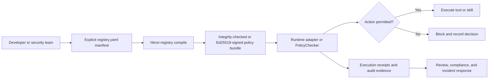

# Hlinor Agent Registry

> **Latest:** [The OpenAI/Hugging Face Sandbox Escape: Why Declarative AI Governance is No Longer Optional](https://dev.to/ishvan/the-openaihugging-face-sandbox-escape-why-declarative-ai-governance-is-no-longer-optional-4onh) - Dev.to article

[](https://pypi.org/project/hlinor-registry/)
[](https://github.com/HlinorAI/hlinor-agent-registry)
[](LICENSE)
[](https://github.com/HlinorAI/hlinor-agent-registry/actions/workflows/test.yml)
[](https://github.com/HlinorAI/hlinor-agent-registry)

Open-source registry layer for auditable AI agent systems. Define what your AI agents may do, validate it before execution, and keep the decision auditable — without replacing the framework that runs your agents.

Hlinor Agent Registry is a declarative governance layer for agent systems. It turns action boundaries, policies, approvals, and runtime evidence into reviewable YAML contracts that developers and security teams can understand.

---

## ⚡ Quickstart (Zero Friction)

Get up and running in 3 simple steps:

### 1. Install
```bash
pip install hlinor-registry
```

### 2. Initialize Templates
Generate a ready-to-use registry manifest and agent policy file with safe defaults:
```bash
hlinor-registry init
```
*(This creates `registry.yaml` and `my_agent.yaml` in your current directory)*

### 3. Compile and Test
Compile your policies into an integrity-checked JSON bundle:
```bash
hlinor-registry compile --manifest registry.yaml --output bundle.json
```

New manifests should declare `schema_version`, `metadata.environment`,
`metadata.bundle_revision`, and `metadata.policy_revision`. The legacy
top-level `version` field remains accepted for migration compatibility.

Test the governance enforcement directly from the CLI:
```bash
# Test an allowed action
hlinor-registry check --bundle bundle.json --agent my-agent --action read_database

# Test a blocked action (Fail-closed in action)
hlinor-registry check --bundle bundle.json --agent my-agent --action send_external_email
```

For an auditable machine-readable decision, emit JSONL and optionally append
the same provenance-aware event to a durable log file:

```bash
hlinor-registry check \
  --bundle bundle.json \
  --agent my-agent \
  --action read_database \
  --format jsonl \
  --audit-log logs/governance-decisions.jsonl
```

Each event includes the decision ID, timestamp, reason code, and SHA-256
digest of the policy bundle used to make the decision. It also binds the
decision to a canonical request digest.

For context-rich evaluation, use the immutable request API:

```python
from hlinor_registry import ActionRequest, PolicyChecker

request = ActionRequest(
    agent_id="financial-audit-agent",
    action="read",
    actor_id="service:finance-prod",
    resource="report:quarterly",
    attributes={"classification": "confidential"},
    environment="production",
)
decision = PolicyChecker("bundle.json").evaluate(request)
```

Unsigned bundles are accepted automatically only when their manifest declares
`development`, `test`, or `local`. Production deployments should use signed
bundles and set `signature_policy="required"` independently of bundle metadata.

### Sign production bundles

Generate an Ed25519 key pair outside the repository:

```bash
openssl genpkey -algorithm ED25519 -out policy-signing-key.pem
openssl pkey \
  -in policy-signing-key.pem \
  -pubout \
  -out policy-signing-key.pub.pem
```

Never commit the private key. Compile deterministically with an explicit
validity window:

```bash
hlinor-registry compile \
  --manifest registry.yaml \
  --output bundle.json \
  --signing-key policy-signing-key.pem \
  --key-id prod-policy-2026-01 \
  --issuer hlinor-policy-ci \
  --issued-at 2026-07-26T00:00:00Z \
  --expires-at 2026-08-26T00:00:00Z
```

Configure the runtime trust root in a deployment-owned file:

```json
{
  "schema_version": "1.0",
  "keys": {
    "prod-policy-2026-01": {
      "algorithm": "Ed25519",
      "public_key_path": "policy-signing-key.pub.pem",
      "issuer": "hlinor-policy-ci"
    }
  }
}
```

Verify the artifact before deployment:

```bash
hlinor-registry verify-bundle \
  --bundle bundle.json \
  --trust-store trust-store.json \
  --signature-policy required \
  --required-issuer hlinor-policy-ci \
  --minimum-bundle-revision 42
```

The same trust requirements are available through `PolicyChecker`:

```python
checker = PolicyChecker(
    "bundle.json",
    trust_store="trust-store.json",
    signature_policy="required",
    required_issuer="hlinor-policy-ci",
    minimum_bundle_revision=42,
)
```

---

## 🛡️ Use cases

### Prevent PII leaks
Keep agents that process sensitive data away from external communication and make the restriction explicit in a reviewed registry file:

```yaml
id: financial-audit-agent
name: Financial Audit Agent
department: finance
description: Audits internal financial reports.
skills: [read_database, anomaly_detection, generate_report]
validators: [financial-data-validator]
policies: [no-pii-in-logs, read-only-database-access]
allowed_actions: [read, analyze, summarize, generate_pdf_report]
blocked_actions: [send_external_email, delete_records]
```

The blocklist takes priority over the allowlist:

```python
from hlinor_registry import PolicyChecker

checker = PolicyChecker("bundle.json")
decision = checker.check_action("financial-audit-agent", "send_external_email")

assert decision.denied
# decision.reason_code: ACTION_BLOCKLISTED
```

The `policies` list on an agent is declarative context for reviewers. It is not
evaluated by `PolicyChecker`, so `decision.matched_policy_ids` is reserved and
currently always empty. See [Known Limitations](SECURITY.md#known-limitations).

### Block unauthorized actions
Use a strict allowlist for agents that should only perform a narrow set of operations. Everything outside the list is denied by `PolicyChecker`:

```python
decision = checker.check_action("research-agent", "delete_records")

if decision.denied:
    print(f"Blocked before execution: {decision.reason_code}")
```

This gives security reviews a concrete answer to the question: “What can this agent do?”

### Enforce API budgets and rate limits
Declare budget and rate-limit policies next to the agent's permitted actions. Adapters or preflight checks can evaluate these policies before a costly call:

```yaml
id: web-research-agent
name: Web Research Agent
department: marketing
description: Collects competitor information from public sources.
skills: [web_search, scrape_public_website, summarize_text]
validators: [public-source-validator]
policies:
  - max_10_searches_per_hour
  - require_budget_check
  - block_known_malicious_domains
allowed_actions: [search, read_public_url, extract_keywords]
blocked_actions: [login_to_website, submit_forms, call_premium_paid_api]
metadata:
  api_budget_limit_usd: 5.00
```

The registry makes the constraint visible, versionable, and reviewable instead of burying it inside one agent implementation.

---

## 🏗️ Architecture


```mermaid
flowchart LR
    A["Developer or security team"] --> B["Explicit registry.yaml manifest"]
    B --> C["hlinor-registry compile"]
    C --> D["Integrity-checked or Ed25519-signed policy bundle"]
    D --> E["Runtime adapter or PolicyChecker"]
    E --> F{"Action permitted?"}
    F -->|Yes| G["Execute tool or skill"]
    F -->|No| H["Block and record decision"]
    E --> I["Execution receipts and audit evidence"]
    I --> J["Review, compliance, and incident response"]
```

Hlinor sits beside your execution framework. Your agents can continue to run in LangChain, CrewAI, or a custom stack while their action boundaries are compiled from an explicit, inspectable manifest.

Long-lived LangChain tools and `@governed` functions detect a changed bundle
and reload it before the next decision. Deploy new bundles atomically so a
running process always observes a complete, digest-verified file.

The compiler writes through a verified temporary file and atomically replaces
the destination. Agent and capability namespaces are separate, unknown
explicit entity types are rejected, and production manifests reject permissive
agents unless the unsafe CLI override is deliberately supplied. A missing
`type` remains compatible with legacy agent files; new files should declare
`type: agent` or `type: capability` explicitly.

Signed bundles bind the policy payload, digest, issuer, key ID, issuance time,
and expiration time to an Ed25519 signature. Runtime trust comes from
deployment-configured public keys, never from a key embedded in the bundle.
Use a trusted minimum bundle revision to enforce a rollback floor.

---

## 🆚 Where Hlinor sits

Three different things get called "AI guardrails". They operate on different
objects and they compose rather than compete.

| Layer | Question it answers | Examples |
| :--- | :--- | :--- |
| Content safety | Is this text acceptable to produce or accept? | NeMo Guardrails, Guardrails AI, Llama Guard |
| Orchestration | What runs next, and with which tool? | LangChain, CrewAI, LangGraph |
| **Action authorization** | **May this agent perform this action right now, and can we prove what was decided?** | **Hlinor Registry** |

Content safety inspects what a model says. Hlinor does not look at text at all.
It sits in front of the side effect: the tool call, the transfer, the outbound
email.

### Why not a general policy engine?

Open Policy Agent and Cedar are the serious comparison, and for a team that
already runs one, the honest answer is that they can express everything the
current `PolicyChecker` does. Three things differ.

| | OPA / Cedar | Hlinor Registry |
| :--- | :--- | :--- |
| Policy language | Rego / Cedar, general-purpose | YAML with a fixed schema, deliberately narrow |
| Audience | Platform engineers | Whoever signs off on what an agent may do |
| Distribution | Bundles you assemble and serve | Signed bundle is the product: Ed25519, digest, issuer, validity window, rollback floor |
| Decision provenance | Build it into your own logging | Every decision carries the bundle digest, request digest, signing key fingerprint, and revision |
| Runtime coupling | Sidecar, service, or embedded evaluator | One Python object reading one local file |

Use OPA or Cedar when you need arbitrary policy logic and already operate the
infrastructure. Reach for Hlinor when the reviewable artifact matters more than
the expressiveness: when someone has to sign what an agent may do, when an
auditor has to be shown which exact policy produced a decision, and when the
answer must not depend on a service being reachable.

The narrowness is the point. A `PolicyChecker` decision is an allowlist and a
blocklist over action names, which is a claim a non-engineer can verify by
reading the YAML.

### Against writing it yourself

Most teams start with a set of if-statements around their tool calls, and that
works. What it does not give you is an artifact: something signed, versioned,
diffable in review, and identical across the services that run your agents.
That, rather than the checking logic, is what this repository is.

Hlinor is not an execution framework. Use it when governance must be explicit,
reviewable, and portable across the systems that execute your agents.

---

## 👥 Who is this for?

- Platform teams building internal agent infrastructure.
- Security and compliance teams reviewing agent capabilities.
- Developers who need a policy boundary before tools cause side effects.
- Teams operating multiple agents across departments or projects.
- Open-source maintainers who want YAML examples and automated validation in CI.

---

## 📦 Installation

### From PyPI
```bash
pip install hlinor-registry
```
The core package requires Python 3.10 or newer, PyYAML, and `cryptography` for
Ed25519 bundle signatures. It does not install LangChain, CrewAI, or another
agent framework.

### Optional integrations
Hlinor is **framework-agnostic**. We provide ready-to-use wrappers for popular agent ecosystems:

#### LangChain
```bash
pip install "hlinor-registry[langchain]"
```
```python
from hlinor_registry.integrations.langchain import GovernedTool

safe_tool = GovernedTool(
    tool=my_langchain_tool,
    agent_id="research-agent",
    bundle_path="./dist/policy-bundle.json",
)
```

#### CrewAI
```bash
pip install "hlinor-registry[crewai]"
```
```python
from hlinor_registry.integrations.crewai import GovernedCrewTool

safe_search_tool = GovernedCrewTool(
    executor=my_crewai_tool,
    agent_id="research-agent",
    action_name="search_web",
    bundle_path="./dist/policy-bundle.json",
)
```

See the [integration compatibility matrix](docs/integration-compatibility.md)
and [`examples/`](examples/) for complete contracts and runnable examples.

### Development dependencies
```bash
pip install -e ".[dev]"
pytest
```

---

## 💻 CLI Reference

**Zero-friction commands:**
```bash
hlinor-registry --version                          # Show version
hlinor-registry init                               # Generate template registry.yaml and my_agent.yaml
hlinor-registry check --bundle X --agent Y --action Z  # Test an action against a compiled bundle
hlinor-registry explain --bundle X --agent Y --action Z  # Get detailed audit explanation
hlinor-registry check --bundle X --agent Y --action Z --format jsonl --audit-log decisions.jsonl
```

**Exit codes for `check` and `explain`:**

| Code | Meaning |
| --- | --- |
| `0` | A decision was reached and the action is allowed |
| `1` | A decision was reached and the action is denied |
| `2` | No decision was reached: bad arguments, missing or unreadable bundle, broken trust configuration, or a failed audit-log write |

Gate on `1` specifically. Treating every non-zero exit as a denial makes a
broken deployment look like working governance.

**Core commands:**
```bash
# Compile an explicit manifest into the integrity-checked runtime bundle
hlinor-registry compile --manifest registry.yaml --output dist/policy-bundle.json

# Explicit unsafe override for controlled migration only
hlinor-registry compile --manifest registry.yaml --output dist/policy-bundle.json \
  --allow-permissive-production

# Validate a registry file
hlinor-registry validate-agent examples/search-agent.yaml

# Validate runtime governance contracts
hlinor-registry validate-execution-context <path>
hlinor-registry validate-action-preflight <path>
hlinor-registry validate-capability <path>
hlinor-registry validate-capability-registration examples/funding_intelligence.yaml
hlinor-registry validate-protected-resource-boundary <path>
hlinor-registry validate-evidence-claim <path>
hlinor-registry validate-circuit-breaker <path>

# Inspect a YAML file without changing it
hlinor-registry inspect <path>
```

---

## 📚 Documentation

### Models and architecture
- [Execution model](docs/execution-model.md)
- [Approval model](docs/approval-model.md)
- [Runtime bindings and execution receipts](docs/runtime-receipts.md)
- [Audit trail](docs/audit-trail.md)
- [ActionRequest and decision provenance](docs/action-request.md)
- [Signed bundles and trust stores](docs/signed-bundles.md)
- [Integration compatibility](docs/integration-compatibility.md)
- [Control Layer architecture](docs/architecture/control-layer-overview.md)
- [Project isolation](docs/architecture/project-isolation.md)
- [Task workspace](docs/architecture/task-workspace.md)
- [Department handoff](docs/architecture/department-handoff.md)

### Governance patterns
- [Production action boundary](docs/patterns/production-action-boundary.md)
- [Protected resource boundary](docs/patterns/protected-resource-boundary.md)
- [Preflight before a costly action](docs/patterns/preflight-before-costly-action.md)
- [Evidence-bound claims](docs/patterns/evidence-bound-claims.md)
- [Capability verification](docs/patterns/capability-verification.md)
- [Agent lifecycle operating modes](docs/patterns/agent-lifecycle-operating-modes.md)

---

## 🛡️ Trust signals

- Comprehensive automated tests covering compilation, validation, policy enforcement, and CLI commands.
- GitHub Actions runs the test suite on Python 3.10, 3.11, 3.12, and 3.13.
- Pre-commit hooks (`ruff`, `mypy`, `yamllint`) ensure consistent code quality.
- Tagged releases use PyPI Trusted Publishing and verify the exact published
  package in a clean environment.
- YAML schemas, examples, and governance decisions are designed to be reviewed in pull requests.
- Licensed under Apache-2.0 for broad open-source and commercial use.

---

## 🤝 Community and support

- [Star the repository](https://github.com/HlinorAI/hlinor-agent-registry) if it helps your team.
- Report bugs or request features through [GitHub Issues](https://github.com/HlinorAI/hlinor-agent-registry/issues).
- Discuss designs and use cases in [GitHub Discussions](https://github.com/HlinorAI/hlinor-agent-registry/discussions).
- Read [CONTRIBUTING.md](CONTRIBUTING.md) before opening a pull request.
- Follow the [Code of Conduct](CODE_OF_CONDUCT.md) when participating.

---

## 🏢 Enterprise

Teams adopting agent governance at scale can contact the HlinorAI team at `hello@hlinor.com` for architecture guidance, policy design, and integration support.

---

## 📜 License

Hlinor Agent Registry is available under the [Apache License 2.0](LICENSE).

## 🚀 Contributing

Contributions are welcome. Start with an issue or pull request that explains the governance problem, the proposed registry contract, and how the behavior is tested.


---
