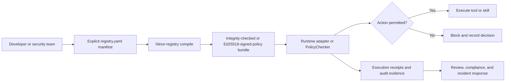

# Hlinor Agent Registry

> **Latest:** [The OpenAI/Hugging Face Sandbox Escape: Why Declarative AI Governance is No Longer Optional](https://dev.to/ishvan/the-openaihugging-face-sandbox-escape-why-declarative-ai-governance-is-no-longer-optional-4onh) - Dev.to article

[](https://pypi.org/project/hlinor-registry/)
[](https://github.com/HlinorAI/hlinor-agent-registry)
[](LICENSE)
[](https://github.com/HlinorAI/hlinor-agent-registry/actions/workflows/test.yml)
[](https://github.com/HlinorAI/hlinor-agent-registry)

Open-source registry layer for auditable AI agent systems. Define what your AI agents may do, validate it before execution, and keep the decision auditable — without replacing the framework that runs your agents.

Hlinor Agent Registry is a declarative governance layer for agent systems. It turns action boundaries, policies, approvals, and runtime evidence into reviewable YAML contracts that developers and security teams can understand.

---

## ⚡ Quickstart

Four steps. The fourth is the one that matters: at the end of it, a function in
your own code cannot run an action the policy does not allow.

### 1. Install
```bash
pip install hlinor-registry
```

### 2. Write the boundary
```bash
hlinor-registry init
```

Three files, meant to be read: `registry.yaml` lists what gets compiled,
`my_agent.yaml` holds one agent's action boundary, and
`refund-needs-approval.yaml` is a policy that gates refunds behind a human
approval.

### 3. Compile it
```bash
hlinor-registry compile --manifest registry.yaml --output bundle.json
```

Compilation reads only the files the manifest names, so what runs is always
something someone listed on purpose. It reports which declared policies are
actually enforced:

```
Successfully compiled 2 entries to bundle.json
Agent 'my-agent' enforces: refund-needs-approval
```

Ask the bundle a few questions before wiring anything up:

```bash
hlinor-registry check --bundle bundle.json --agent my-agent --action read_database
hlinor-registry check --bundle bundle.json --agent my-agent --action send_external_email
hlinor-registry check --bundle bundle.json --agent my-agent --action read_database --resource reports/q1
hlinor-registry check --bundle bundle.json --agent my-agent --action read_database --resource customers/pii
hlinor-registry check --bundle bundle.json --agent my-agent --action refund_payment --resource order/1234
```

Allowed, denied, allowed, denied, denied. The fourth is the resource pattern
doing its job — `read_database` is permitted, but only over `reports/*`. The
fifth is the policy: the action is allowed, and the request carried no
approval.

Exit codes are `0` allowed, `1` denied, `2` no decision reached. An unreadable
bundle or an unusable signals file is the third, never the second, because a
caller that cannot tell those apart reads a broken deployment as working
governance.

### 4. Govern a real function

Everything above is a rehearsal. This is the part that changes what your code
can do:

```python
from hlinor_registry import GovernanceDeniedError
from hlinor_registry.integrations.decorators import governed


@governed(
    agent_id="my-agent",
    action="refund_payment",
    bundle_path="bundle.json",
    resource=lambda call: f"order/{call.kwargs['order_id']}",
    signals=lambda call: call.kwargs.get("approval", {}),
)
def refund(*, order_id: str, amount: int, approval=None) -> str:
    return charge_api.refund(order_id, amount)


try:
    refund(order_id="1234", amount=5000)
except GovernanceDeniedError as denial:
    print(denial.decision.reason_code)  # POLICY_SIGNAL_MISSING
    print(denial.decision.policy_detail)  # which policy refused, and why
```

The call raises before the function body runs. Nothing reaches
`charge_api.refund` unless the bundle permits it.

`resource` and `signals` are what connect the decorator to the rest of the
bundle. Either can be a fixed value, or a callable receiving the invocation so
the resource can be read off the arguments of the call being authorized.
Without them a decorated function can only ever ask about a bare action name,
which no scoped allow list and no policy will match.

Give the same refund an approval that names it and the call goes through; give
it one granted for another order and it does not:

```python
from datetime import datetime, timezone

approval = {
    "approval": {
        "approver_role": "support-lead",
        "granted_for": "refund_payment:order/1234",
        # The policy allows 900 seconds. A fixed timestamp here would work
        # once and then stop, which is the point of a freshness window.
        "granted_at": datetime.now(timezone.utc).isoformat(),
    }
}

refund(order_id="1234", amount=5000, approval=approval)  # runs
refund(order_id="9999", amount=5000, approval=approval)  # APPROVAL_REQUIRED
```

If your agent is a LangChain or CrewAI tool, wrap the tool instead of the
function — same parameters:

```python
from hlinor_registry.integrations.langchain import GovernedTool

safe_tool = GovernedTool(
    tool=my_langchain_tool,
    agent_id="my-agent",
    bundle_path="bundle.json",
    resource=lambda call: call.kwargs.get("order_id"),
)
```

Both need the matching extra: `pip install "hlinor-registry[langchain]"` or
`[crewai]`. Runnable versions of all three are in
[`examples/`](examples/).

### Where to go next

- Scope actions to resources and gate them behind policies:
  [Use cases](#%EF%B8%8F-use-cases) below.
- Know exactly what the runtime does and does not enforce:
  [What is enforced at runtime](#%EF%B8%8F-what-is-enforced-at-runtime).
- Ship it: [Production hardening](#-production-hardening) covers signing,
  trust roots, and rollback floors.

---

## 🛡️ Use cases

### Prevent PII leaks
Keep agents that process sensitive data away from external communication and make the restriction explicit in a reviewed registry file:

```yaml
id: financial-audit-agent
name: Financial Audit Agent
department: finance
description: Audits internal financial reports.
skills: [read_database, anomaly_detection, generate_report]
validators: [financial-data-validator]
policies: [no-pii-in-logs, read-only-database-access]
allowed_actions: [read, analyze, summarize, generate_pdf_report]
blocked_actions: [send_external_email, delete_records]
```

The blocklist takes priority over the allowlist:

```python
from hlinor_registry import PolicyChecker

checker = PolicyChecker("bundle.json")
decision = checker.check_action("financial-audit-agent", "send_external_email")

assert decision.denied
# decision.reason_code: ACTION_BLOCKLISTED
```

Block-list matching ignores case, so no spelling of a blocked name gets
through. Allow-list matching is exact, so an approval is never extended to a
spelling that was not literally approved. Both directions resolve toward
denial, and authoring validation rejects action names that differ only by case.

A `policies` entry with a compiled typed policy behind it is evaluated at
runtime and appears in `decision.matched_policy_ids` — see
[Require an approval, evidence, or a failure budget](#require-an-approval-evidence-or-a-failure-budget).
An entry naming no compiled policy stays declarative context for reviewers, as
every entry was before 0.8.0.

### Scope an action to the resources it may touch

An action list entry may be a glob over a colon-separated key. The key is the
action alone when a request names no resource, and `action:resource` when it
does:

```yaml
allowed_actions:
  - read:report:quarterly/*
  - classify:ticket:*
blocked_actions:
  - read:report:quarterly/secret*
```

```python
from hlinor_registry import ActionRequest, PolicyChecker

checker = PolicyChecker("bundle.json")

decision = checker.evaluate(
    ActionRequest(
        agent_id="report-agent",
        action="read",
        resource="report:quarterly/q1",
    )
)
assert decision.allowed
assert decision.matched_pattern == "read:report:quarterly/*"

decision = checker.evaluate(
    ActionRequest(
        agent_id="report-agent",
        action="read",
        resource="report:quarterly/secret-q1",
    )
)
assert decision.denied  # ACTION_BLOCKLISTED
assert decision.matched_pattern == "read:report:quarterly/secret*"
```

`decision.matched_pattern` names the entry that produced the decision. Unlike
`matched_policy_ids` it is computed from the comparison that was actually made,
so an audit record can say *denied by `read:report:quarterly/secret*`* rather
than just *denied*.

**The syntax is deliberately tiny.** `*` and `?` are the whole vocabulary.
There is no `**`, no character class, no alternation, no regular expression and
no negation; `hlinor-registry validate` rejects all of them with a message
saying what to use instead. If a decision needs a condition rather than a name,
that belongs in a policy object, not in a pattern.

Two properties are worth knowing before you write one:

- **An entry with no wildcard is an exact match.** `read` matches the action
  `read` with no resource, and does *not* match `read:report:quarterly`. Every
  action list written before patterns existed decides exactly as it did.
- **`*` crosses `:`.** `send:email:*` therefore also matches
  `send:email:external:someone`. A broad allow pattern grants more than its
  shape suggests, and only the block list narrows it. `hlinor-registry lint`
  says so whenever an allow pattern and a block pattern can match the same
  request key — decided exactly, not by comparing prefixes — because deleting
  that block entry would silently widen the agent:

```
Notes for agent.yaml:
  - 'send:email:*' also covers 'send:email:external:*'; the wildcard crosses
    ':' and only 'blocked_actions' narrows it. Removing the block entry would
    widen what this agent may do.
```

  This is a note, not a failure: `lint` still exits 0. The syntax has no
  negation, so "everything under this prefix except that" can only be written
  as a broad allow plus a block, and rejecting the only available spelling of
  a common intent would just teach people to skip the linter. Warnings — which
  do fail — are reserved for a file that says one thing and does another, such
  as `allowed_actions: ["*"]` under `enforcement_mode: strict`.

Block-list matching still ignores case and allow-list matching is still exact,
in both directions resolving toward denial. A block entry with no wildcard also
covers every resource: `blocked_actions: [delete_records]` refuses
`delete_records` on anything, which is what it looks like it says.

### Require an approval, evidence, or a failure budget

Action lists answer *may this agent touch this resource at all*. A **policy**
answers the question that comes next: given that it may, what must be true of
this particular request. A policy is its own file, compiled into the same
bundle, and an agent opts in by naming it:

```yaml
# refund-requires-approval.yaml
type: policy
id: refund-requires-approval
name: Refund Requires Approval
description: A refund needs a recent approval naming that refund.
enforcement: Enforced by PolicyChecker; the adapter supplies the approval.
kind: requires_approval
trigger:
  - refund_payment:*
requires:
  approver_role: support-lead
  max_age_seconds: 900
```

```yaml
# refund-agent.yaml
policies: [refund-requires-approval]
allowed_actions: [refund_payment:ticket/*]
```

```python
decision = checker.evaluate(
    ActionRequest(
        agent_id="refund-agent",
        action="refund_payment",
        resource="ticket/1234",
        signals={
            "approval": {
                "approver_role": "support-lead",
                "granted_for": "refund_payment:ticket/1234",
                "granted_at": "2026-07-27T11:58:00Z",
            }
        },
    )
)
assert decision.allowed
assert decision.matched_policy_ids == ("refund-requires-approval",)
```

Without that approval the same request is denied, and `decision.policy_detail`
says which policy refused and what was missing. `matched_policy_ids` now names
the policies that were actually evaluated — it was a reserved, always-empty
field until this release.

Three handler kinds ship today:

| `kind` | Reads from `signals` | Refuses when |
| :--- | :--- | :--- |
| `requires_approval` | `approval` | no approval, wrong role, approval granted for a different request, or outside the freshness window |
| `requires_evidence` | `evidence` | a required claim type is absent, does not name the request's resource, or is outside the window |
| `failure_threshold` | `failure_counts` | the reported consecutive-failure count reaches `max_consecutive_failures` |

Turn those expectations into deterministic regression tests:

```bash
hlinor-registry compile \
  --manifest registry.yaml \
  --output dist/policy-bundle.json

hlinor-registry test-policies \
  --bundle dist/policy-bundle.json \
  --tests examples/policy-tests/refund-policy-tests.yaml
```

The suite fixes the evaluation time, then checks the result, reason code, and
matched policy IDs for every request. See
[Deterministic policy tests](docs/policy-tests.md) for the versioned YAML
format, JSON output, and CI exit-code contract.

Freshness is a window with two ends. A timestamp older than `max_age_seconds`
is stale; one dated more than 30 seconds ahead of the checker's clock is
refused rather than treated as very fresh. `bind_to_request` and
`same_resource` default to `true` and must be written as real YAML booleans —
`0` or `"false"` is refused at compile time and by the runtime, so a binding
check cannot be switched off by something that merely looks false.

`same_resource` fails closed: if it is on, the request itself must name a
resource. A request with no resource is denied rather than having the
comparison skipped.

Two properties hold for all of them:

- **Policies only restrict.** They run after the allow list has already
  permitted the action, so a satisfied policy can never re-enable something the
  block list refuses or the allow list omits. Reading the action lists still
  tells you the widest thing an agent can do.
- **A policy an agent names but that nobody compiled stays declarative**, as
  every `policies:` entry was before this release. `hlinor-registry compile`
  prints the split so the difference is visible before signing:

```
Agent 'refund-agent' enforces: refund-requires-approval
Agent 'refund-agent' declares but does not enforce: no-customer-pii-in-logs (no compiled policy with that id)
```

**What this does not establish.** Signals are asserted by the caller.
`PolicyChecker` runs inside the process it governs and cannot tell whether an
approval was really granted. What it enforces is that the action does not
proceed unless the obligation is claimed, in a form that is recorded and
digested, and that the claim is internally consistent — bound to this request,
inside the window, about this resource. Those catch the mistakes that actually
happen. They do not stop an adapter that fabricates signals. See
[Known Limitations](SECURITY.md#known-limitations).

### Block unauthorized actions
Use a strict allowlist for agents that should only perform a narrow set of operations. Everything outside the list is denied by `PolicyChecker`:

```python
decision = checker.check_action("research-agent", "delete_records")

if decision.denied:
    print(f"Blocked before execution: {decision.reason_code}")
```

This gives security reviews a concrete answer to the question: “What can this agent do?”

### Declare API budgets and rate limits for review
Budget and rate-limit policies sit next to the agent's permitted actions, so a
reviewer sees them together. **`PolicyChecker` does not enforce them** — see
[What is enforced at runtime](#what-is-enforced-at-runtime) below. Your adapter
or preflight check reads them and decides:

```yaml
id: web-research-agent
name: Web Research Agent
department: marketing
description: Collects competitor information from public sources.
skills: [web_search, scrape_public_website, summarize_text]
validators: [public-source-validator]
policies:
  - max_10_searches_per_hour
  - require_budget_check
  - block_known_malicious_domains
allowed_actions: [search, read_public_url, extract_keywords]
blocked_actions: [login_to_website, submit_forms, call_premium_paid_api]
metadata:
  api_budget_limit_usd: 5.00
```

The registry makes the constraint visible, versionable, and reviewable instead of burying it inside one agent implementation.

---

## ⚖️ What is enforced at runtime

The repository ships 22 schemas and a set of governance patterns. Most of them
are **authoring contracts**: they are validated when you compile, and they give
reviewers a shared vocabulary. They are not evaluated when an agent asks to do
something. Read this table before you rely on any of it.

| Concern | Validated at compile time | Enforced by `PolicyChecker` |
| :--- | :---: | :---: |
| Action allow list and block list | yes | **yes** |
| Resource scope via action patterns (`read:report:*`) | yes | **yes** |
| Typed policies: approval, evidence, failure threshold | yes | **yes** |
| Unknown agent, unknown action | yes | **yes** |
| Bundle integrity, signature, issuer, validity window | yes | **yes** |
| Rollback floor (`minimum_bundle_revision`) | — | **yes** |
| Enforcement mode (`strict` / `permissive`) | yes | **yes** |
| Budgets and rate limits | yes | no |
| Approval levels, as a `requires_approval` policy | yes | **yes** |
| Approval levels, as `approval-*` schema fields | yes | no |
| `protected-resource-boundary` schema | yes | no |
| Evidence binding, as a `requires_evidence` policy | yes | **yes** |
| Circuit breakers, as a `failure_threshold` policy | yes | **yes** |
| `evidence-claim-binding` / `failure-circuit-breaker` schemas | yes | no |
| Execution context and capability verification | yes | no |
| Lifecycle modes and transition gates | yes | no |
| Named `policies:` entry with no compiled policy behind it | yes | no |
| Declared capabilities | yes | inventory only |

`PolicyChecker.evaluate()` answers two questions. May this agent perform this
action on this resource, according to the compiled allow and block lists of a
bundle whose integrity and signature check out? And if it may, do the typed
policies the agent declares accept this particular request? Everything in the
"no" column is a contract your own code, a preflight step, or a human review
has to act on.

The second question is answered from signals the caller supplies. That is a
real gate — the action does not proceed unless the obligation is claimed — but
it is a gate against omission and mistake, not against a caller that lies.

Capabilities are a third category: compiled into the bundle and readable
through `checker.capabilities` and `checker.get_capability_info()`, but never
consulted by a decision. Use them to inspect what a bundle declares, not to
conclude that anything is gated on them.

This is deliberate — an action-name gate is a claim a non-engineer can verify
by reading the YAML — but it is easy to over-read a repository this size, so it
is stated rather than implied. Progress toward enforcing more of the table is
tracked in [Known Limitations](SECURITY.md#known-limitations).

---

## 🏗️ Architecture


```mermaid
flowchart LR
    A["Developer or security team"] --> B["Explicit registry.yaml manifest"]
    B --> C["hlinor-registry compile"]
    C --> D["Integrity-checked or Ed25519-signed policy bundle"]
    D --> E["Runtime adapter or PolicyChecker"]
    E --> F{"Action permitted?"}
    F -->|Yes| G["Execute tool or skill"]
    F -->|No| H["Block and record decision"]
    E --> I["Execution receipts and audit evidence"]
    I --> J["Review, compliance, and incident response"]
```

Hlinor sits beside your execution framework. Your agents can continue to run in LangChain, CrewAI, or a custom stack while their action boundaries are compiled from an explicit, inspectable manifest.

Long-lived LangChain tools and `@governed` functions detect a changed bundle
and reload it before the next decision. Deploy new bundles atomically so a
running process always observes a complete, digest-verified file.

The compiler writes through a verified temporary file and atomically replaces
the destination. Agent and capability namespaces are separate, unknown
explicit entity types are rejected, and production manifests reject permissive
agents unless the unsafe CLI override is deliberately supplied. A missing
`type` remains compatible with legacy agent files; new files should declare
`type: agent` or `type: capability` explicitly.

Signed bundles bind the policy payload, digest, issuer, key ID, issuance time,
and expiration time to an Ed25519 signature. Runtime trust comes from
deployment-configured public keys, never from a key embedded in the bundle.
Use a trusted minimum bundle revision to enforce a rollback floor.

---

## 🔐 Production hardening

Everything below is for the deployment, not the first five minutes.

**Configure trust roots and signatures become mandatory.** Passing
`trust_store` or `trusted_keys` upgrades the default `signature_policy="auto"`
to `"required"`. Without that, whether a signature was required would come from
`metadata.environment` inside the bundle being verified — so anyone able to
rewrite the deployed file could strip the signature, declare the bundle a
development build, and disable authentication.

With no trust roots configured there is nothing to verify against, and unsigned
bundles are accepted only when the manifest declares `development`, `test`, or
`local`. `signature_policy="optional"` remains an explicit override for
controlled migration.

### Sign production bundles

Generate an Ed25519 key pair outside the repository:

```bash
openssl genpkey -algorithm ED25519 -out policy-signing-key.pem
openssl pkey \
  -in policy-signing-key.pem \
  -pubout \
  -out policy-signing-key.pub.pem
```

Never commit the private key. Compile deterministically with an explicit
validity window:

```bash
hlinor-registry compile \
  --manifest registry.yaml \
  --output bundle.json \
  --signing-key policy-signing-key.pem \
  --key-id prod-policy-2026-01 \
  --issuer hlinor-policy-ci \
  --issued-at 2026-07-26T00:00:00Z \
  --expires-at 2026-08-26T00:00:00Z
```

Configure the runtime trust root in a deployment-owned file:

```json
{
  "schema_version": "1.0",
  "keys": {
    "prod-policy-2026-01": {
      "algorithm": "Ed25519",
      "public_key_path": "policy-signing-key.pub.pem",
      "issuer": "hlinor-policy-ci"
    }
  }
}
```

Verify the artifact before deployment:

```bash
hlinor-registry verify-bundle \
  --bundle bundle.json \
  --trust-store trust-store.json \
  --signature-policy required \
  --required-issuer hlinor-policy-ci \
  --minimum-bundle-revision 42
```

The same trust requirements are available through `PolicyChecker`:

```python
checker = PolicyChecker(
    "bundle.json",
    trust_store="trust-store.json",
    signature_policy="required",
    required_issuer="hlinor-policy-ci",
    minimum_bundle_revision=42,
)
```

---

---

## 🆚 Where Hlinor sits

Three different things get called "AI guardrails". They operate on different
objects and they compose rather than compete.

| Layer | Question it answers | Examples |
| :--- | :--- | :--- |
| Content safety | Is this text acceptable to produce or accept? | NeMo Guardrails, Guardrails AI, Llama Guard |
| Orchestration | What runs next, and with which tool? | LangChain, CrewAI, LangGraph |
| **Action authorization** | **May this agent perform this action right now, and can we prove what was decided?** | **Hlinor Registry** |

Content safety inspects what a model says. Hlinor does not look at text at all.
It sits in front of the side effect: the tool call, the transfer, the outbound
email.

### Why not a general policy engine?

Open Policy Agent and Cedar are the serious comparison, and for a team that
already runs one, the honest answer is that they can express everything the
current `PolicyChecker` does. Three things differ.

| | OPA / Cedar | Hlinor Registry |
| :--- | :--- | :--- |
| Policy language | Rego / Cedar, general-purpose | YAML with a fixed schema, deliberately narrow |
| Audience | Platform engineers | Whoever signs off on what an agent may do |
| Distribution | Bundles you assemble and serve | Signed bundle is the product: Ed25519, digest, issuer, validity window, rollback floor |
| Decision provenance | Build it into your own logging | Every decision carries the bundle digest, request digest, signing key fingerprint, and revision |
| Runtime coupling | Sidecar, service, or embedded evaluator | One Python object reading one local file |

Use OPA or Cedar when you need arbitrary policy logic and already operate the
infrastructure. Reach for Hlinor when the reviewable artifact matters more than
the expressiveness: when someone has to sign what an agent may do, when an
auditor has to be shown which exact policy produced a decision, and when the
answer must not depend on a service being reachable.

The narrowness is the point. A `PolicyChecker` decision is an allowlist and a
blocklist over action names, which is a claim a non-engineer can verify by
reading the YAML.

### Against writing it yourself

Most teams start with a set of if-statements around their tool calls, and that
works. What it does not give you is an artifact: something signed, versioned,
diffable in review, and identical across the services that run your agents.
That, rather than the checking logic, is what this repository is.

Hlinor is not an execution framework. Use it when governance must be explicit,
reviewable, and portable across the systems that execute your agents.

---

## 👥 Who is this for?

- Platform teams building internal agent infrastructure.
- Security and compliance teams reviewing agent capabilities.
- Developers who need a policy boundary before tools cause side effects.
- Teams operating multiple agents across departments or projects.
- Open-source maintainers who want YAML examples and automated validation in CI.

---

## 📦 Installation

### From PyPI
```bash
pip install hlinor-registry
```
The core package requires Python 3.10 or newer, PyYAML, `jsonschema`, and
`cryptography` for Ed25519 bundle signatures. It does not install LangChain,
CrewAI, AutoGen, or another agent framework.

### Optional integrations
Hlinor is **framework-agnostic**. We provide ready-to-use wrappers for popular agent ecosystems:

#### LangChain
```bash
pip install "hlinor-registry[langchain]"
```
```python
from hlinor_registry.integrations.langchain import GovernedTool

safe_tool = GovernedTool(
    tool=my_langchain_tool,
    agent_id="research-agent",
    bundle_path="./dist/policy-bundle.json",
)
```

#### CrewAI
```bash
pip install "hlinor-registry[crewai]"
```
```python
from hlinor_registry.integrations.crewai import GovernedCrewTool

safe_search_tool = GovernedCrewTool(
    executor=my_crewai_tool,
    agent_id="research-agent",
    action_name="search_web",
    bundle_path="./dist/policy-bundle.json",
)
```

#### Microsoft AutoGen
```bash
pip install "hlinor-registry[autogen]"
```
```python
from hlinor_registry.integrations.autogen import export_autogen_tool_contract

observed_contract = export_autogen_tool_contract(
    tools,
    contract_id="production-autogen-tools",
    name="Production AutoGen Tools",
    description="Tools exposed to the production agent.",
    version="1.0.0",
    owner="Agent Platform Team",
    governance=tool_governance,
)
```

Custom Python stacks can export explicit schemas with
`CustomToolDescriptor` and `export_custom_tool_contract` without installing an
agent framework. AutoGen and custom exporters synchronize Tool Contracts; they
do not wrap execution by themselves.

See the [integration compatibility matrix](docs/integration-compatibility.md)
and [framework exporter guide](docs/framework-exporters.md) for governed
wrappers, Tool Contract export, and CI drift gates.

### Development dependencies
```bash
pip install -e ".[dev]"
pytest
```

---

## 💻 CLI Reference

**Zero-friction commands:**
```bash
hlinor-registry --version                          # Show version
hlinor-registry init                               # Generate template registry.yaml and my_agent.yaml
hlinor-registry check --bundle X --agent Y --action Z  # Test an action against a compiled bundle
hlinor-registry explain --bundle X --agent Y --action Z  # Get detailed audit explanation
hlinor-registry check --bundle X --agent Y --action Z --format jsonl --audit-log decisions.jsonl
```

**Exit codes for `check` and `explain`:**

| Code | Meaning |
| --- | --- |
| `0` | A decision was reached and the action is allowed |
| `1` | A decision was reached and the action is denied |
| `2` | No decision was reached: bad arguments, missing or unreadable bundle, broken trust configuration, or a failed audit-log write |

Gate on `1` specifically. Treating every non-zero exit as a denial makes a
broken deployment look like working governance.

**Core commands:**
```bash
# Compile an explicit manifest into the integrity-checked runtime bundle
hlinor-registry compile --manifest registry.yaml --output dist/policy-bundle.json

# Explicit unsafe override for controlled migration only
hlinor-registry compile --manifest registry.yaml --output dist/policy-bundle.json \
  --allow-permissive-production

# Validate a registry file
hlinor-registry validate-agent examples/search-agent.yaml

# Validate runtime governance contracts
hlinor-registry validate-execution-context <path>
hlinor-registry validate-action-preflight <path>
hlinor-registry validate-capability <path>
hlinor-registry validate-capability-registration examples/funding_intelligence.yaml
hlinor-registry validate-tool-contract examples/tool-contracts/customer-support-tools.yaml
hlinor-registry validate-protected-resource-boundary <path>
hlinor-registry validate-evidence-claim <path>
hlinor-registry validate-circuit-breaker <path>

# Detect undeclared tool scopes and stale agent permissions
hlinor-registry contract check \
  --agent examples/tool-contracts/customer-support-agent.yaml \
  --tools examples/tool-contracts/customer-support-tools.yaml

# Compare a reviewed Tool Contract with a fresh runtime export
hlinor-registry contract diff \
  --expected tool-contract.yaml \
  --observed exported-tool-contract.yaml

# Inspect a YAML file without changing it
hlinor-registry inspect <path>
```

Contract commands return `0` when aligned, `1` when drift is found, and `2`
when an input cannot be validated. Add `--format json` for stable CI output.

---

## 📚 Documentation

### Models and architecture
- [Execution model](docs/execution-model.md)
- [Approval model](docs/approval-model.md)
- [Runtime bindings and execution receipts](docs/runtime-receipts.md)
- [Audit trail](docs/audit-trail.md)
- [ActionRequest and decision provenance](docs/action-request.md)
- [Signed bundles and trust stores](docs/signed-bundles.md)
- [Integration compatibility](docs/integration-compatibility.md)
- [Tool Contracts](docs/tool-contracts.md)
- [Tool Contract compatibility and migration](docs/tool-contract-versioning.md)
- [Runtime performance and benchmarks](docs/performance.md)
- [RFC 0001: Trusted Tool Contract runtime binding](docs/rfcs/0001-trusted-tool-contract-runtime-binding.md)
- [Framework Tool Exporters](docs/framework-exporters.md)
- [Control Layer architecture](docs/architecture/control-layer-overview.md)
- [Project isolation](docs/architecture/project-isolation.md)
- [Task workspace](docs/architecture/task-workspace.md)
- [Department handoff](docs/architecture/department-handoff.md)

### Governance patterns
- [Production action boundary](docs/patterns/production-action-boundary.md)
- [Protected resource boundary](docs/patterns/protected-resource-boundary.md)
- [Preflight before a costly action](docs/patterns/preflight-before-costly-action.md)
- [Evidence-bound claims](docs/patterns/evidence-bound-claims.md)
- [Capability verification](docs/patterns/capability-verification.md)
- [Agent lifecycle operating modes](docs/patterns/agent-lifecycle-operating-modes.md)

---

## 🛡️ Trust signals

- Comprehensive automated tests covering compilation, validation, policy enforcement, and CLI commands.
- GitHub Actions runs the test suite on Python 3.10, 3.11, 3.12, and 3.13.
- Pre-commit hooks (`ruff`, `mypy`, `yamllint`) ensure consistent code quality.
- Tagged releases use PyPI Trusted Publishing and verify the exact published
  package in a clean environment.
- YAML schemas, examples, and governance decisions are designed to be reviewed in pull requests.
- Licensed under Apache-2.0 for broad open-source and commercial use.

---

## 🤝 Community and support

- [Star the repository](https://github.com/HlinorAI/hlinor-agent-registry) if it helps your team.
- Report bugs or request features through [GitHub Issues](https://github.com/HlinorAI/hlinor-agent-registry/issues).
- Discuss designs and use cases in [GitHub Discussions](https://github.com/HlinorAI/hlinor-agent-registry/discussions).
- Read [CONTRIBUTING.md](CONTRIBUTING.md) before opening a pull request.
- Follow the [Code of Conduct](CODE_OF_CONDUCT.md) when participating.

---

## 🏢 Enterprise

Teams adopting agent governance at scale can contact the HlinorAI team at `hello@hlinor.com` for architecture guidance, policy design, and integration support.

---

## 📜 License

Hlinor Agent Registry is available under the [Apache License 2.0](LICENSE).

## 🚀 Contributing

Contributions are welcome. Start with an issue or pull request that explains the governance problem, the proposed registry contract, and how the behavior is tested.


---
