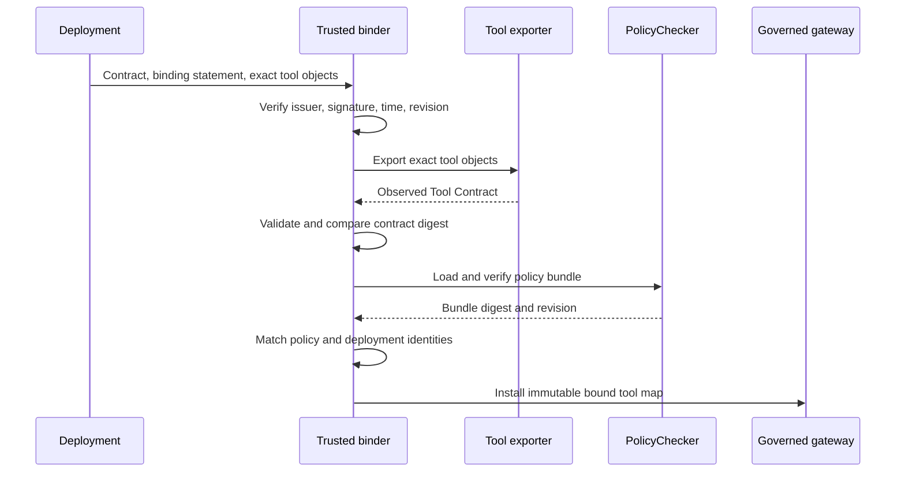

# RFC 0001: Trusted Tool Contract runtime binding

- Status: Proposed
- Authors: HlinorAI maintainers
- Created: 2026-07-31
- Target: post-v0.9 experimental implementation

## Summary

This RFC defines how a reviewed Tool Contract may eventually become a trusted
runtime input without turning declarative metadata into authority by accident.

The proposed design binds:

- one verified Tool Contract digest;
- one exact runtime tool object or attested implementation;
- one compiled policy bundle digest;
- one agent, action, session, and environment;
- one normalized argument payload and target resource scope;
- one time-bounded, signed binding statement.

Dispatch remains fail-closed. A tool may execute only when the binding, policy
decision, arguments, and target scope all match immediately before the side
effect.

This document remains a design proposal for the full signed binding protocol.
An in-process MVP now implements the exact-object, JCS digest, normalized
argument, resource-scope, and fail-closed dispatch subset described in
[`docs/runtime-binding.md`](../runtime-binding.md). Tool Contracts still do not
grant policy authority, and the MVP does not claim that current exporters prove
deployment artifact provenance or human approval.

## Motivation

The stable Tool Contract format describes what a runtime says it exposes.
Exporters can compare those descriptions with reviewed files, but comparison
alone does not prove that:

- the process will invoke the same tool object that was exported;
- the reviewed contract has not been replaced or rolled back;
- runtime arguments satisfy the reviewed JSON Schema;
- a tool name was not rebound after startup;
- an approval still covers the exact arguments and target;
- an unwrapped execution path cannot bypass governance.

Runtime binding closes that gap. It must do so without weakening the existing
rule that the compiled policy bundle is the authorization source.

## Goals

- Authenticate the reviewed contract used by a production runtime.
- Bind a descriptor to the exact implementation dispatched by a governed gate.
- Detect contract, policy, implementation, argument, and resource drift.
- Define deterministic JSON Schema behavior across supported SDKs.
- Prevent stale binding and approval replay.
- Preserve fail-closed behavior under missing, invalid, expired, or unknown
  inputs.
- Produce receipts that identify the exact evidence behind every decision.
- Support framework adapters without trusting framework tool names alone.

## Non-goals

- Proving that arbitrary application code has no hidden side-effect path.
- Treating tool annotations such as `read_only` as verified facts.
- Giving Tool Contracts authority to widen an agent's action allowlist.
- Performing semantic PII or anonymization analysis.
- Loading remote JSON Schema references at runtime.
- Replacing sandboxing, operating-system permissions, workload identity, or
  network policy.
- Designing a centralized enterprise control plane in this RFC.

## Existing guarantees

The current release already provides:

- strict Tool Contract schema `1.0` validation;
- framework-neutral tool identities and action mappings;
- expected-versus-observed drift comparison;
- compiled policy bundle digest and signature verification;
- minimum policy bundle revision enforcement;
- immutable `ActionRequest` and provenance-rich `PolicyDecision` records;
- wrappers that call policy evaluation before the wrapped tool.

The runtime binding MVP additionally provides an immutable in-process map from
reviewed contract tool IDs to exact callable references, RFC 8785 contract and
argument digests, normalized argument validation, and contract resource-scope
checks before the existing policy gate.

The in-process exact-object relationship is now implemented by the binding MVP.
The remaining guarantees are the cryptographic relationship to an approved
request, deployment provenance, and independently durable evidence of what was
dispatched.

## Terms

**Reviewed contract**
: A validated Tool Contract approved through the deployment process.

**Observed contract**
: A Tool Contract exported from the exact runtime objects supplied to a binder.

**Contract digest**
: `sha256:<hex>` over the RFC 8785 JSON Canonicalization Scheme representation
  of a validated contract.

**Implementation identity**
: Evidence identifying what will receive dispatch. It may be an in-process
  object binding or a deployment artifact attestation.

**Binding statement**
: A signed, time-bounded document joining contract, implementation, policy,
  deployment, and anti-rollback identities.

**Bound tool**
: An immutable association between one descriptor and the exact dispatch
  target held by the governed runtime.

## Trust model

### Trust roots

A production deployment explicitly configures:

- trusted Ed25519 public keys and allowed issuers;
- the required contract and binding revisions;
- the expected deployment or artifact identity when available;
- the minimum accepted policy bundle revision;
- an authenticated clock source within configured skew;
- the governed dispatch gateway that owns the bound tool map.

No trust root may be derived solely from the contract being verified.

### Protected assets

- authority to execute side effects;
- policy and approval integrity;
- confidential tool arguments;
- the mapping from tool identity to implementation;
- audit provenance and anti-rollback state.

### Attacker capabilities

The design assumes an attacker may:

- control model output and attempt prompt injection;
- choose tool names, arguments, and targets exposed to the agent;
- modify unsigned files available to the application;
- replay an old contract, binding, request, or approval;
- register another tool with the same or similar name;
- exploit argument coercion, defaults, unknown properties, or schema ambiguity;
- race a mutable framework registry between validation and dispatch;
- invoke an ungoverned application path if the application exposes one.

The design does not claim to survive compromise of the operating system, the
trusted signing key, or the process that owns the dispatch gateway. Those
controls require key management, workload isolation, and deployment security.

## Security invariants

1. Tool Contracts never widen compiled policy authority.
2. A name match is not an implementation binding.
3. The object validated is the object dispatched; no late name lookup occurs.
4. Arguments are validated after framework normalization and before dispatch.
5. The validated argument object is the object delivered to the tool.
6. External schema retrieval is disabled.
7. Every contract, policy, implementation, argument, resource, or approval
   change invalidates the previous binding.
8. Unknown versions, algorithms, fields, and reason states fail closed.
9. Production binding requires trusted signatures and rollback protection.
10. Denials and binding failures produce receipts before returning control.
11. Verification failures cannot fall back to an ungoverned tool.

## Contract canonicalization and digest

The digest input is the complete validated Tool Contract after YAML has been
loaded into the JSON data model. It is canonicalized with RFC 8785 JCS and
hashed as UTF-8 bytes with SHA-256.

Implementations must:

- reject duplicate YAML or JSON keys before canonicalization;
- reject non-JSON values, NaN, infinity, and values outside supported numeric
  interoperability limits;
- validate the exact supported `schema_version`;
- retain every schema field, including descriptions and metadata;
- compare digests using constant-time byte comparison;
- use published cross-language golden vectors.

Descriptions and metadata do not affect drift findings today, but they remain
inside the authenticated contract. Removing them from the digest would allow
an attacker to alter reviewed ownership or provenance claims.

The project must not implement a private approximation of JCS. Python,
TypeScript, and Go SDKs must produce identical vectors before runtime binding
is considered stable.

## Detached binding statement

Tool Contract `1.0` does not contain a signature field. Adding one would require
a new schema version, so trust is carried by a detached binding statement.

Conceptual shape:

```json
{
  "schema_version": "1.0",
  "binding_id": "support-runtime-2026-07-31",
  "binding_revision": 42,
  "contract_id": "support-tools",
  "contract_version": "3.2.0",
  "contract_digest": "sha256:...",
  "policy_bundle_digest": "sha256:...",
  "minimum_policy_bundle_revision": 18,
  "agent_id": "support-agent",
  "environment": "production",
  "deployment_identity": "oci:sha256:...",
  "issued_at": "2026-07-31T00:00:00Z",
  "expires_at": "2026-08-01T00:00:00Z",
  "issuer": "hlinor-deployment",
  "key_id": "production-2026-q3",
  "algorithm": "ed25519",
  "signature": "base64url..."
}
```

The signature covers a domain-separated canonical payload including every
field except `signature`. The final specification must publish the exact
domain separator and golden signature vectors.

`contract_version` is owner-supplied SemVer and is not an anti-rollback
counter. `binding_revision` is a positive, issuer-scoped monotonic integer.

## Implementation binding modes

### In-process object binding

The binder receives the exact tool objects that will be supplied to the agent
framework. It exports the observed contract from those objects, compares it
with the reviewed digest, and stores an immutable map:

```text
(contract_digest, tool_id) -> exact object reference
```

Governed dispatch uses the stored reference. Looking up a tool again by name,
reading a mutable framework registry, or accepting a replacement object after
binding is prohibited.

This mode proves an in-process identity relationship for the lifetime of the
binder. It does not prove the provenance of the code that created the object.

### Attested artifact binding

A deployment may additionally bind the statement to an immutable artifact
identity such as an OCI image digest, signed wheel provenance, or workload
attestation.

Artifact identity strengthens provenance but cannot replace in-process object
binding. A trusted image can still select the wrong callable at runtime.

Python module names, qualified names, package versions, and source paths are
diagnostic metadata only. They are not unique or tamper-resistant identities.

## Startup sequence



Any failed step prevents the governed gateway from becoming ready.

## Pre-dispatch sequence

For every invocation, the gateway:

1. Resolves `(contract_digest, tool_id)` in the immutable bound map.
2. Rejects an unknown, duplicate, expired, revoked, or superseded binding.
3. Applies framework parsing without executing the tool.
4. Captures the exact JSON-compatible argument object that will be dispatched.
5. Validates it against the bound Draft 2020-12 input schema.
6. Canonicalizes and hashes the validated arguments.
7. Derives the target resource through an explicit application adapter.
8. Confirms the target matches both contract resource patterns and the active
   session or approval binding.
9. Builds one immutable `ActionRequest`.
10. Reloads trusted policy state according to the runtime reload contract.
11. Evaluates the request exactly once.
12. Emits a decision or binding-failure receipt.
13. Calls the exact stored object only when every gate allowed the request.

The gateway must not validate one object and dispatch a mutated copy. Defaults
and coercions must be materialized before hashing and validation.

## JSON Schema runtime semantics

- Dialect is JSON Schema Draft 2020-12.
- The bound schema must be self-contained.
- Network retrieval and external `$ref` targets are forbidden.
- Unknown vocabularies fail binding.
- `format` remains annotation unless a future contract version names required
  format assertions and cross-language behavior.
- `default` is annotation; the governance layer does not insert it.
- `additionalProperties` is enforced exactly as reviewed.
- Numeric behavior must be covered by cross-language vectors.
- Validator exceptions and timeouts are denials, not skipped checks.

Framework adapters may parse and coerce arguments, but the final values passed
to the tool must be the values validated and hashed by Hlinor.

## Resource binding

JSON Schema validation does not prove which account, file, tenant, URL, or
database row a tool will affect. Every runtime integration that claims
resource-scoped authorization must provide a deterministic resource extractor.

The extractor:

- receives only the normalized argument object and immutable invocation
  context;
- performs no network or tool calls;
- returns one canonical resource string or a typed failure;
- is identified in the binding statement or deployment identity;
- runs before policy evaluation and dispatch.

If a contract declares resource patterns and no extractor can derive the
target, dispatch fails closed.

## Rollback and replay protection

Production runtimes persist the highest accepted `binding_revision` for each
`(issuer, environment, contract_id)` tuple. A lower revision is rejected even
when its signature and validity window are otherwise correct.

The runtime also enforces:

- the configured minimum policy bundle revision;
- binding expiry and issuer restrictions;
- session, tenant, agent, contract, policy, argument, and resource equality;
- single-use approval semantics when the approval model requires them.

If durable revision state is unavailable, production binding must require an
operator-supplied minimum revision. It may not silently downgrade to
best-effort replay detection.

## Failure behavior

The future implementation should introduce stable reason codes such as:

- `TOOL_BINDING_REQUIRED`
- `TOOL_BINDING_UNTRUSTED`
- `TOOL_BINDING_EXPIRED`
- `TOOL_BINDING_ROLLBACK`
- `TOOL_CONTRACT_DRIFT`
- `TOOL_IMPLEMENTATION_MISMATCH`
- `TOOL_ARGUMENT_SCHEMA_INVALID`
- `TOOL_RESOURCE_UNRESOLVED`
- `TOOL_RESOURCE_SCOPE_MISMATCH`

Names are proposed, not yet public API. Each failure must:

- block before side effect;
- identify the request and available trusted digests;
- avoid logging raw arguments by default;
- distinguish denial from invalid runtime configuration;
- produce an append-only receipt when a sink is configured.

An unavailable receipt sink must follow an explicit deployment policy.
High-assurance mode fails closed; lower-assurance modes may buffer locally but
must never report successful durable audit delivery before it occurs.

## Threat analysis

| Threat | Required control | Residual risk |
| --- | --- | --- |
| Prompt injection selects a dangerous tool | Compiled policy remains authoritative; bound tool cannot widen it | Allowed tools may still be misused inside approved scope |
| Tool name substituted after review | Exact object map; no late name lookup | Compromised process can alter memory |
| Reviewed contract replaced | Trusted detached signature and digest | Signing-key compromise |
| Old safe contract replayed | Monotonic binding revision and expiry | Lost or inconsistent revision store |
| Arguments changed after approval | Hash normalized dispatched object; bind approval to digest | Tool may interpret external mutable state |
| Framework coercion changes meaning | Validate post-coercion dispatched values | Framework parser defects |
| External `$ref` changes schema | Self-contained schemas; no network retrieval | Validator implementation defects |
| Mutable tool registry races dispatch | Immutable bound reference | Tool object's own internals may be mutable |
| Extra unwrapped tool path exists | Deployment integration tests and least-privilege sandbox | Registry cannot prove application-wide mediation |
| Resource differs from argument claim | Deterministic extractor and scope match | Tool may ignore its declared target |
| Audit sink unavailable | Explicit fail-closed or durable buffering policy | Lower-assurance buffering can delay detection |

## Rollout plan

1. Publish JCS, digest, and signature golden vectors for Python, TypeScript, and
   Go.
2. Specify and validate the detached binding document.
3. Implement verification and anti-rollback state without dispatch.
4. Prototype in-process binding for custom Python tools.
5. Extend existing LangChain and CrewAI wrappers to bind the same objects they
   dispatch.
6. Add argument validation, resource extractors, signed approvals, and receipts
   behind an experimental API. Signed approval, durable replay/revocation,
   checkpointed receipts, and circuit-breaker primitives now exist; independent
   collection remains open.
7. Run adversarial substitution, replay, coercion, and race tests.
8. Stabilize only after two independent SDKs produce identical vectors.

No step may change current Tool Contract files into runtime authority before
the preceding trust controls are complete.

## Acceptance criteria

An implementation of this RFC is not ready for stable release until:

- canonical digests match across at least Python and one non-Python SDK;
- signature and rollback tests include negative golden vectors;
- the exact exported object is proven to be the dispatched object;
- argument validation uses the final dispatched values;
- external schema retrieval is impossible;
- every mismatch blocks before a test side effect;
- concurrency tests demonstrate no mutable lookup race;
- receipts contain contract, binding, policy, request, argument, and resource
  digests without raw secret-bearing arguments;
- performance impact is measured against the published benchmark baseline.

## Alternatives rejected

**Trust the framework tool name.** Names are mutable and non-unique.

**Put a contract digest in the system prompt.** Model-visible text is not a
runtime trust boundary.

**Validate only in CI.** CI detects reviewed drift but not runtime substitution
or replay.

**Sign the Tool Contract by adding a field to schema `1.0`.** The stable schema
rejects unknown fields; a detached statement preserves compatibility.

**Use contract SemVer for rollback protection.** Owner-controlled SemVer is not
a monotonic security counter.

**Validate raw model arguments.** Framework coercion or defaults may change the
values that reach the tool.

**Use source paths or qualified Python names as implementation identity.**
Both can identify different code in another environment or after monkeypatching.

## Open questions

- Which maintained JCS implementation should each SDK depend on?
- Should the detached statement reuse the policy bundle signature envelope or
  use a shared signed-artifact envelope?
- How should revocation state be distributed without requiring a central
  service for local deployments?
- Which resource extractor interface is deterministic across sync and async
  adapters?
- Which artifact attestations are required for the first production profile?
- Should high-assurance audit delivery be mandatory for all production modes?

These questions block stable enforcement, not publication of the RFC.
